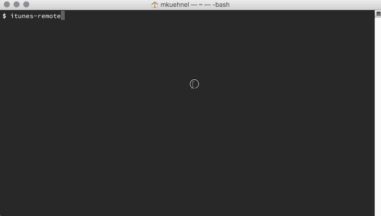

[](https://www.npmjs.org/package/itunes-remote)
[](https://coveralls.io/github/mischah/itunes-remote?branch=master)
[](https://david-dm.org/mischah/itunes-remote#info=devDependencies)
[](https://david-dm.org/mischah/itunes-remote#info=Dependencies)
[](https://www.youtube.com/watch?v=ihXfH-zR8qA&feature=youtu.be&t=10s)
[](https://github.com/sindresorhus/awesome-nodejs)

# itunes-remote

> Control iTunes via your terminal :notes:

Using [JXA](https://developer.apple.com/library/mac/releasenotes/InterapplicationCommunication/RN-JavaScriptForAutomation/Articles/Introduction.html) via [osascript](https://developer.apple.com/library/mac/documentation/Darwin/Reference/ManPages/man1/osascript.1.html) via Node.js.

## Requirements

- Node.js (v0.12.7 or greater)
- Mac OS X (Yosemite 10.10.0 or greater)
- Some tracks in your iTunes library

## Demo


## Install

```
$ npm install --global itunes-remote
```


## Usage

It’s interactive and offering an own prompt.

```
$ itunes
iTunes: help

  Commands:

    help [command...]              Provides help for a given command.
    exit                           Exit itunes-remote.
    play                           Start playing the current selection
    play artist                    Plays songs by an artist.
    play album                     Plays an album.
    stop                           Stop playing the current selection
    pause                          Pause playing the current selection
    next                           Advance to the next track in the current playlist.
    previous                       Return to the previous track in the current playlist.
    back                           Reposition to beginning of current track or go to previous track if already at
                                   start of current track.
    search [options] <searchterm>  Fuzzy search album, artists and songs.

iTunes: 
```

**Note:**  
You can also pass commands and options from the outside.

```
$ itunes stop --exit
iTunes:
✔ Stopped playing ♪♬
$
```

## Thanks
Special shoutout to [@dthree](https://github.com/dthree) for his nice way to offer support for [vorpal](https://github.com/dthree/vorpal) :blush:

This tiny little module wouldn‘t be possible without the work of [all these amazing humans](thanks.md). Thanks. 

## License

MIT © [Michael Kühnel](http://michael-kuehnel.de)
